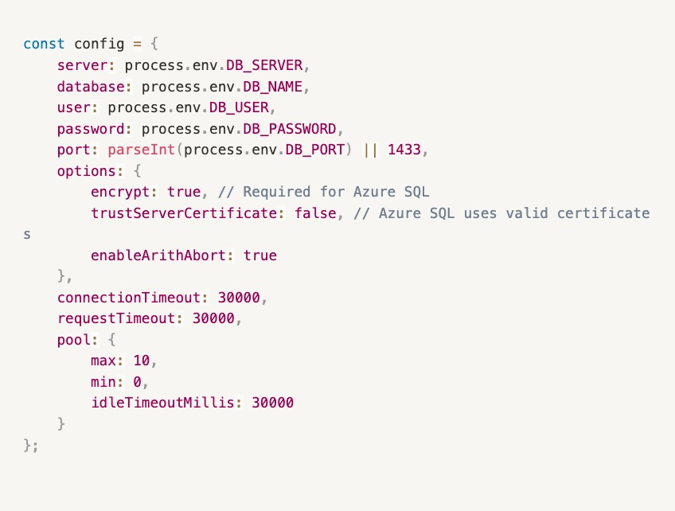
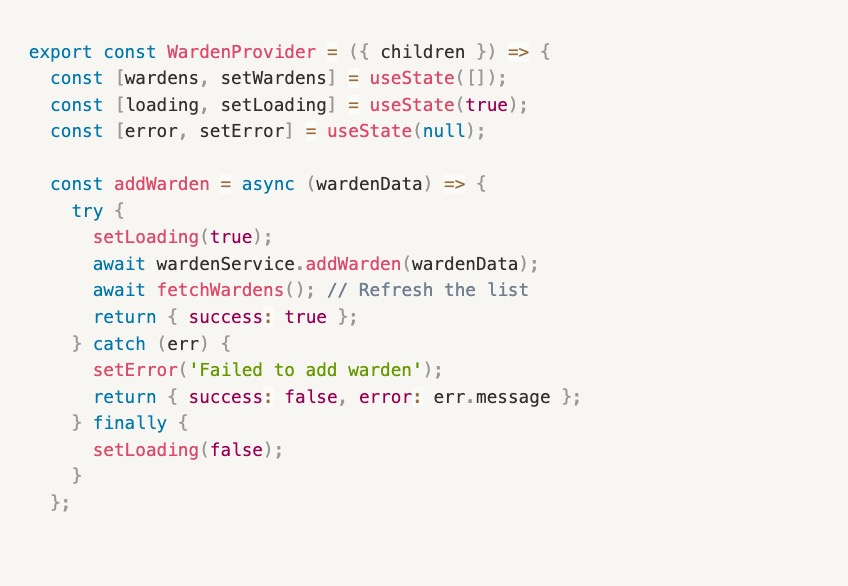
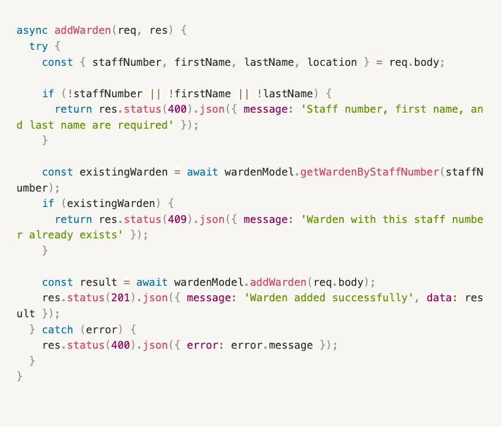

 
BS2202 – Developing for the cloud
[Developing for the cloud Portfolio]

Tutors: Chris Helcoop
 Word Count 2,000 | Date of Submission: 9th May 2023| Student Number: 2107853

Executive Summary
This Development Portfolio presents a cloud-based Fire Warden Management System developed for the University of Winchester, addressing critical challenges in emergency preparedness across their three-campus infrastructure. The client's primary challenge stems from managing approximately 70 voluntary fire wardens who balance safety responsibilities with regular duties, compounded by established remote working policies that obscure daily staff locations (Bharosa et al., 2010).
The system leverages Microsoft Azure's cloud infrastructure to provide real-time location tracking and centralized dashboard functionality, aligning with contemporary trends in institutional digital transformation (Almarabeh & AbuAli, 2010). Key opportunities include enhanced emergency response coordination, scalable architecture supporting future mobile integration, and improved compliance with health and safety regulations. However, challenges encompass ensuring user adoption across diverse staff demographics, maintaining data accuracy through voluntary reporting, and balancing accessibility with security requirements.
This full-stack implementation utilizes modern web technologies (React.js, Node.js, Express.js) integrated with Azure SQL Database, positioning the University for enhanced emergency management capabilities while establishing a foundation for future mobile application development.
Client Requirements Summary
Functional Requirements	Technical Requirements
Record unique staff numbers	Microsoft Azure hosting
Capture first and surname	HTML, CSS implementation
Log working locations (31 buildings)	JavaScript development
Timestamp entry creation	Node.js backend
Enable data amendments	Express.js API framework
Support record deletion	React.js frontend
Provide Health & Safety dashboard	Azure SQL Database
Support PC/laptop access	Full-stack architecture
System Design and Discussion
Cloud system design represents a fundamental paradigm shift in enterprise application architecture, necessitating careful consideration of numerous interconnected complexities that directly impact system performance, maintainability, and long-term viability (Armbrust et al., 2010). The Fire Warden Management System exemplifies these design principles through its strategic implementation of a three-tier architecture deployed across Microsoft Azure's cloud infrastructure, demonstrating how contemporary cloud-native approaches address institutional challenges while maintaining operational flexibility.
Scalability considerations permeate every aspect of the system's architectural design, reflecting the dynamic nature of educational institutions and their evolving technological demands. The implemented Node.js backend leverages Express.js framework's asynchronous capabilities, enabling horizontal scaling through Azure App Service's auto-scaling features (Tilkov & Vinoski, 2010). The system's database layer utilizes Azure SQL Database with connection pooling configuration, maintaining a maximum of ten concurrent connections while supporting automatic scaling based on demand metrics. This approach addresses the University of Winchester's requirement to support approximately 70 fire wardens across three campuses, with architectural provisions for substantial growth without performance degradation. The React.js frontend implements lazy loading and component-based architecture, enabling efficient client-side scaling through code splitting and dynamic imports.
Vendor lock-in and portability concerns require strategic mitigation to ensure long-term institutional flexibility and cost management. The Fire Warden System demonstrates platform-agnostic design principles through its implementation of standard technologies and containerizable architecture (Gartner, 2019). While Azure SQL Database provides the current data persistence layer, the system's abstraction through environment variables and standardized SQL queries facilitates migration to alternative database providers. The Express.js API layer utilizes RESTful principles and standard HTTP protocols, ensuring compatibility across diverse hosting environments. React.js frontend development follows industry-standard practices, avoiding Azure-specific client libraries that could complicate future platform transitions.
Virtualisation strategies underpin the system's deployment model, leveraging Azure's container orchestration capabilities to ensure consistent runtime environments across development, testing, and production phases. The containerized approach facilitates seamless deployment scaling and resource optimization, with Docker containerization enabling efficient resource utilization across Azure's virtualized infrastructure (Bernstein, 2014). This virtualisation strategy supports the University's requirement for reliable access across multiple campuses while maintaining consistent user experiences regardless of geographic distribution.
Cost control mechanisms are embedded throughout the architectural design, reflecting educational institutions' budgetary constraints and financial accountability requirements. The system implements Azure SQL Database's elastic pool configuration, optimizing database resource allocation based on actual usage patterns rather than peak capacity provisioning. Connection pooling reduces database resource consumption, while the stateless API design minimizes server resource requirements. The React.js single-page application architecture reduces bandwidth consumption through efficient data loading and caching strategies, directly impacting operational costs over time.
Reusability principles guide the system's modular architecture, supporting the University's stated intention to develop mobile applications and integrate with existing institutional systems. The RESTful API design enables seamless integration with diverse client applications, while the Model-View-Controller pattern facilitates component reuse across different user interfaces. Context providers in React.js enable shared state management across multiple components, reducing code duplication and improving maintainability. The middleware-based Express.js architecture supports extensible functionality through modular component integration.
Availability requirements drive the system's fault-tolerance and reliability mechanisms, critical for emergency management applications where downtime could compromise safety protocols. Azure SQL Database provides 99.99% uptime guarantees through built-in redundancy and automatic failover capabilities (Microsoft, 2023). The connection pooling implementation includes retry logic and graceful degradation strategies, ensuring continued operation during temporary network disruptions. Error handling middleware provides comprehensive exception management throughout the application stack, maintaining system stability under various failure scenarios.
The architectural implementation demonstrates sophisticated understanding of cloud-native design principles while addressing specific institutional requirements. The separation of concerns through distinct presentation, business logic, and data layers enables independent scaling and maintenance of system components. Environment-based configuration management supports seamless deployment across multiple environments while maintaining security best practices through encrypted connections and parameterized database queries.
Contemporary cloud system design requires balancing competing priorities of performance, cost, security, and maintainability within institutional constraints (Buyya et al., 2009). The Fire Warden Management System successfully navigates these complexities through strategic technology selection, architectural patterns, and deployment strategies that position the University of Winchester for long-term technological sustainability while meeting immediate operational requirements.
Implementation Details
The Fire Warden Management System demonstrates sophisticated cloud-native design principles through strategic technology selection and architectural decisions that optimize both development efficiency and deployment scalability. The implementation leverages modern JavaScript frameworks and cloud-optimized database solutions to create a robust, maintainable application suitable for enterprise-grade Azure deployment (Tilkov & Vinoski, 2010).
The programming language selection centers around JavaScript's ubiquity across both client and server environments, enabling full-stack development with consistent syntax and shared development expertise. The frontend implementation utilizes React.js version 19.1.0, incorporating modern functional components with hooks for state management and lifecycle operations. React Router DOM facilitates client-side routing, creating a single-page application architecture that reduces server load and improves user experience through seamless navigation transitions (Gackenheimer, 2015). The backend leverages Node.js with Express.js framework, providing asynchronous request handling capabilities essential for cloud deployments where concurrent user access patterns vary significantly throughout operational periods.
Code Snippet 1: Azure SQL Database Configuration

This configuration exemplifies cloud-first design principles through environment variable abstraction, encrypted connections, and connection pooling optimization. The implementation addresses Azure SQL Database's specific requirements while maintaining portability through standardized configuration patterns. Connection pooling with a maximum of ten concurrent connections prevents resource exhaustion while accommodating the University's 70 fire wardens accessing the system simultaneously during shift changes or emergency situations.

The Microsoft Azure database approach emphasizes security, performance, and scalability through multiple architectural decisions. The mssql library provides parameterized query support, preventing SQL injection vulnerabilities while maintaining compatibility with Azure SQL Database's advanced features including automatic scaling and integrated backup solutions (Microsoft, 2023). The connection configuration implements Azure's mandatory encryption requirements while utilizing trusted server certificates for production security standards. Request timeout configurations accommodate potential network latency variations across the University's three-campus infrastructure, ensuring consistent user experiences regardless of geographic location.

Code Snippet 2: React Context State Management
 

The React Context implementation demonstrates modern state management patterns that facilitate component reusability and maintain application state consistency across complex user interactions. This approach eliminates prop drilling while providing centralized error handling and loading state management, crucial for cloud applications where network latency and intermittent connectivity require sophisticated user feedback mechanisms (Banks & Porcello, 2020).
Styling considerations balance functional requirements with accessibility principles, implementing responsive design patterns that accommodate the specified PC and laptop access requirements while maintaining future mobile compatibility. The CSS implementation utilizes flexbox layouts and media queries, ensuring consistent user experiences across diverse screen resolutions and browser environments. Colour schemes follow accessibility guidelines with sufficient contrast ratios, while loading animations and error states provide clear user feedback during asynchronous operations common in cloud-based applications.
Code Snippet 3: Express.js RESTful Controller
 
 
The Express.js controller implementation exemplifies RESTful API design principles with comprehensive error handling, input validation, and appropriate HTTP status codes. This stateless architecture enables horizontal scaling across Azure App Service instances while maintaining data consistency through database-level constraints and business logic validation (Richardson & Ruby, 2007).
The implementation's cloud deployment suitability manifests through environment-based configuration management, stateless application design, and containerization readiness. Environment variables abstract sensitive configuration data while enabling seamless deployment across development, staging, and production environments. The application's stateless nature ensures compatibility with Azure's auto-scaling capabilities, while the modular architecture supports microservices migration strategies for future scalability requirements.
Performance optimization strategies include connection pooling, efficient database queries with proper indexing, and React's built-in optimization features including virtual DOM reconciliation and component memoization. These optimizations directly address cloud deployment challenges where network latency and resource costs require careful balance between performance and operational expenses.
Reflection
Developing the Fire Warden Management System has been a transformative learning experience that challenged my understanding of full-stack development and cloud architecture. The most significant revelation was comprehending how seemingly straightforward requirements translate into complex technical decisions with far-reaching implications for scalability, security, and maintainability.
The process taught me that cloud-based development requires fundamentally different thinking compared to traditional web applications. Initially, I approached the project with a conventional mindset, but quickly realized that considerations like connection pooling, environment variable management, and stateless design weren't just best practices—they were essential for Azure deployment success. The Azure SQL Database integration proved particularly educational, forcing me to understand encryption requirements, connection timeout configurations, and the nuances of cloud database security that don't exist in local development environments.
My biggest challenge emerged when configuring the database connection between my local development environment and Azure SQL Database. The connection kept failing despite following documentation, leading to hours of troubleshooting connection strings, firewall rules, and authentication methods. The breakthrough moment came when I realized that Azure SQL requires specific SSL configurations and connection pooling strategies that differ significantly from traditional SQL Server implementations. This experience taught me the importance of reading cloud-specific documentation rather than relying on general tutorials.
React Context for state management presented another learning curve. Initially, I considered using Redux due to its popularity, but implementing React Context proved more appropriate for this application's scope. The challenge was designing context providers that efficiently managed loading states, error handling, and data synchronization across components without unnecessary re-renders. This taught me that technology choices should align with project requirements rather than industry trends.
The aspects I found surprisingly straightforward were the RESTful API design and Express.js implementation. My prior experience with JavaScript made the transition to Node.js natural, and Express.js's middleware approach felt intuitive. However, this familiarity led me to challenge myself further by implementing comprehensive error handling, input validation, and proper HTTP status codes throughout the API layer.
Before final deployment, several improvements are essential. The authentication system requires complete overhaul with JWT implementation and proper password hashing. Currently, the simplified authentication serves development purposes but lacks production security standards. Additionally, comprehensive testing coverage is crucial—while I implemented basic functionality testing, unit tests for individual components and integration tests for API endpoints would ensure deployment confidence.
Regarding mobile version development, the primary pain points would center around user interface adaptation and offline functionality. The current desktop-focused interface would require complete redesign for touch interactions and smaller screens. More significantly, mobile fire wardens might need offline capabilities to log locations in areas with poor connectivity, requiring local storage implementation and data synchronization strategies when connectivity returns.
The development process highlighted areas requiring further skill development, particularly DevOps practices and automated deployment pipelines. While I successfully configured Azure services manually, implementing continuous integration and deployment through GitHub Actions would streamline the development workflow. Additionally, performance optimization techniques, especially database query optimization and frontend bundle size reduction, represent knowledge gaps that would benefit from focused learning.
References
Almarabeh, T. & AbuAli, A. (2010). A general framework for e-government: definition maturity challenges, opportunities, and success. European Journal of Scientific Research, 39(1), 29-42. Available at: https://www.researchgate.net/publication/228786088_A_General_Framework_for_E-Government_Definition_Maturity_Challenges_Opportunities_and_Success
Bharosa, N., Lee, J. & Janssen, M. (2010). Challenges and obstacles in sharing and coordinating information during multi-agency disaster response: Propositions from field exercises. Information Systems Frontiers, 12(1), 49-65. Available at: https://link.springer.com/article/10.1007/s10796-009-9174-z
Armbrust, M., Fox, A., Griffith, R., Joseph, A. D., Katz, R., Konwinski, A., Lee, G., Patterson, D., Rabkin, A., Stoica, I. & Zaharia, M. (2010). A view of cloud computing. Communications of the ACM, 53(4), 50-58. Available at: https://dl.acm.org/doi/10.1145/1721654.1721672
Bernstein, D. (2014). Containers and cloud: From LXC to Docker to Kubernetes. IEEE Cloud Computing, 1(3), 81-84. Available at: https://ieeexplore.ieee.org/document/6927345
Buyya, R., Yeo, C. S., Venugopal, S., Broberg, J. & Brandic, I. (2009). Cloud computing and emerging IT platforms: Vision, hype, and reality for delivering computing as the 5th utility. Future Generation Computer Systems, 25(6), 599-616. Available at: https://www.sciencedirect.com/science/article/pii/S0167739X08001957
Gartner (2019). How to Develop a Cloud Strategy to Avoid Vendor Lock-In. Available at: https://www.gartner.com/en/documents/3947237/how-to-develop-a-cloud-strategy-to-avoid-vendor-lock-in
Microsoft (2023). Azure SQL Database SLA. Available at: https://azure.microsoft.com/en-gb/support/legal/sla/azure-sql-database/v1_6/
Tilkov, S. & Vinoski, S. (2010). Node.js: Using JavaScript to build high-performance network programs. IEEE Internet Computing, 14(6), 80-83. Available at: https://ieeexplore.ieee.org/document/5677517
Banks, A. & Porcello, E. (2020). Learning React: Modern Patterns for Developing React Apps. 2nd ed. O'Reilly Media. Available at: https://learning.oreilly.com/library/view/learning-react-2nd/9781492051718/
Gackenheimer, C. (2015). Introduction to React. Apress. Available at: https://link.springer.com/book/10.1007/978-1-4842-1245-5
Microsoft (2023). Azure SQL Database Documentation. Available at: https://docs.microsoft.com/en-us/azure/azure-sql/database/
Richardson, L. & Ruby, S. (2007). RESTful Web Services. O'Reilly Media. Available at: https://learning.oreilly.com/library/view/restful-web-services/9780596529260/
Tilkov, S. & Vinoski, S. (2010). Node.js: Using JavaScript to build high-performance network programs. IEEE Internet Computing, 14(6), 80-83. Available at: https://ieeexplore.ieee.org/document/5677517
